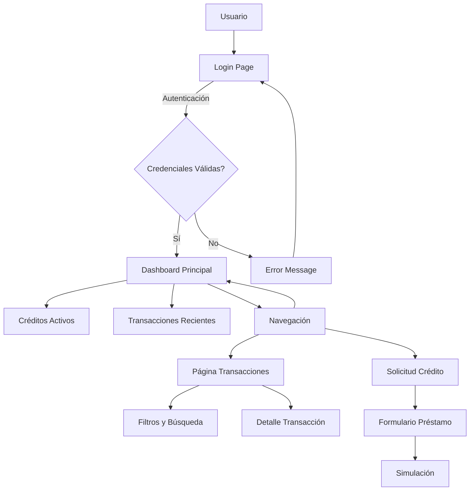
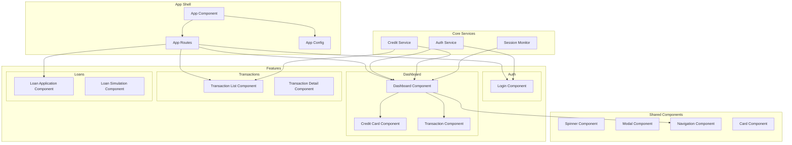
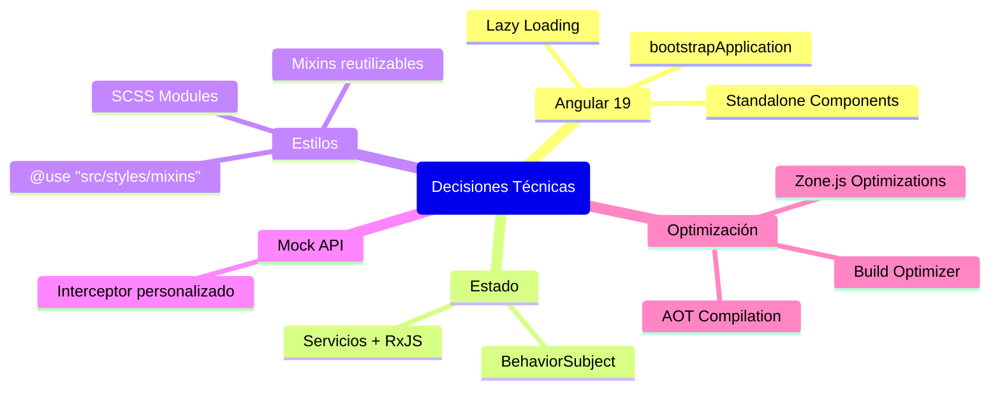
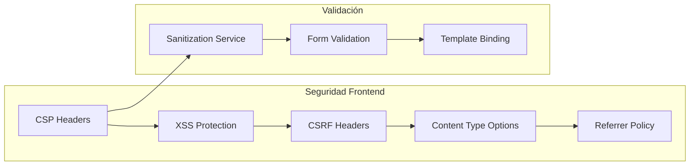
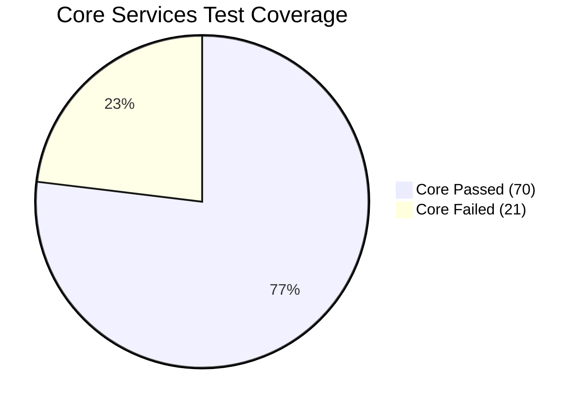

# Dashboard Financiero 🚀

[](https://angular.io/)
[](https://www.typescriptlang.io/)
[](https://sass-lang.com/)
[](https://fontawesome.com/)

Dashboard Financiero es una aplicación de gestión financiera personal para el mercado colombiano. Permite visualizar balances, transacciones, solicitar préstamos y gestionar el perfil financiero con datos mock contextualizados.

---

## 📋 Tabla de Contenidos

- [Descripción](#-descripción)
- [Funcionalidades](#-funcionalidades)
- [Arquitectura](#-arquitectura)
  - [Estructura de Directorios](#-estructura-de-directorios)
  - [Flujo de la Aplicación](#flujo-de-la-aplicación)
  - [Arquitectura de Componentes](#arquitectura-de-componentes)
- [Tecnologías](#-tecnologías-y-dependencias)
- [Datos Mock](#-datos-mock)
- [Instalación](#-instalación-y-ejecución)
- [Scripts Disponibles](#-scripts-disponibles)
- [Decisiones Técnicas](#-decisiones-técnicas)
- [Buenas Prácticas](#-buenas-prácticas)
- [Seguridad](#-seguridad)
- [Testing](#-testing)
- [Credenciales](#-credenciales-de-prueba)
- [Contacto](#-contacto)

---

## 📖 Descripción

Dashboard Financiero es una SPA desarrollada con Angular 20 y Standalone Components.

### ✨ Funcionalidades

**Funcionalidades clave:**

- Créditos activos y saldo pendiente
- Visualización de balances y transacciones
- Solicitud y simulación de préstamos

La autenticación se simula con credenciales hardcodeadas y, tras el login, se accede al dashboard.

---

## 🏗️ Arquitectura

### 📁 Estructura de Directorios

```
src/
├─ app/                        # Dominio de la aplicación
│   ├─ core/                   # Servicios globales y configuración
│   │   ├─ auth.service.ts
│   │   └─ session-monitor.service.ts
│   ├─ data/                   # Mocks, guards y type definitions
│   ├─ models/                 # Interfaces y tipos de dominio
│   ├─ shared/                 # Componentes reutilizables (spinner, modal, cards, nav)
│   ├─ features/               # Módulos de características (auth, dashboard, transactions, loan)
│   ├─ app.component.ts         # Componente raíz (Standalone)
│   ├─ app.config.ts           # Configuración de aplicación (provideHttpClient, interceptors)
│   └─ app.routes.ts           # Definición de rutas (Standalone Routing)
├─ styles/                     # Estilos globales y mixins
│   └─ _mixins.scss            # Mixins y variables SCSS
├─ index.html                  # Plantilla HTML principal con meta tags de seguridad
├─ styles.scss                 # Estilos globales (imports, resets)
└─ main.ts                     # Bootstrap de la aplicación con bootstrapApplication()
```

### Flujo de la Aplicación



### Arquitectura de Componentes



---

## 🧰 Tecnologías y Dependencias

| Categoría      | Tecnología                       | Versión | Propósito                                     |
| -------------- | -------------------------------- | ------- | --------------------------------------------- |
| **Framework**  | Angular                          | 19      | Framework principal con Standalone Components |
| **Estado**     | RxJS                             | 7       | Gestión de estado reactiva                    |
| **Estilos**    | SCSS                             | -       | Modules y mixins personalizados               |
| **Iconos**     | @fortawesome/angular-fontawesome | 1.x     | Iconografía de la aplicación                  |
| **Desarrollo** | Husky                            | 8       | Git hooks para calidad de código              |
| **Desarrollo** | Commitlint                       | 19      | Conventional commits                          |
| **Desarrollo** | lint-staged                      | 16      | Lint en archivos staged                       |
| **Desarrollo** | Prettier                         | 3       | Formateo de código                            |

---

## 🗃️ Datos Mock

### Usuarios Disponibles

- **Carlos Rodríguez**
- **María González**
- **Juan Pérez**

### Tipos de Transacciones

- Servicios públicos
- Hipoteca
- Pagos
- Compras tarjetas

### Configuración de Préstamos

- **Tasas de interés:** Entre 12.5% y 18.5%
- **Categorías disponibles:**
  - Vivienda
  - Vehículo

---

## ⚙️ Instalación y Ejecución

### Prerrequisitos

- [Node.js](https://nodejs.org/) (v18+ recomendado)
- [npm](https://www.npmjs.com/) o [yarn](https://yarnpkg.com/)
- [Angular CLI](https://cli.angular.io/) (opcional, para comandos adicionales)

### Pasos de Instalación

1. **Clonar el repositorio:**

```bash
  git clone <url-del-repositorio>
  cd dashboard-financiero
```

2. **Instalar dependencias:**

```bash
  npm install
```

3. **Ejecutar servidor de desarrollo:**

```bash
  npm start
  # o alternativamente
  ng serve
```

4. **Abrir en el navegador:**

```
  http://localhost:4200/
```

---

## 🛠️ Scripts Disponibles

| Script         | Comando         | Descripción                             |
| -------------- | --------------- | --------------------------------------- |
| **Desarrollo** | `npm start`     | Levanta el servidor en modo desarrollo  |
| **Producción** | `npm run build` | Genera build optimizado para producción |
| **Testing**    | `npm test`      | Ejecuta suite de pruebas unitarias      |

---

## 🛠️ Decisiones Técnicas

### Stack Tecnológico



### Principales Decisiones

- **Angular 19** con Standalone Components y `bootstrapApplication()`
- **Estado**: Servicios + RxJS (BehaviorSubject)
- **Estilos**: SCSS Modules con `@use "src/styles/mixins"` y mixins reutilizables
- **Iconos**: FontAwesome 6 (serie 1.x)
- **Mock API**: `Http-client` + Interceptor personalizado
- **Rutas**: Lazy loading por feature
- **Optimización**: AOT, lazy loading, build optimizer

---

## 🎨 Buenas Prácticas

### Principios de Desarrollo

- **Tipado Estricto:** Usar `unknown` en lugar de `any` para forzar chequeos de tipo explícitos
- **Type Guards:** Implementar funciones de validación (`isXYZ`) para discriminar tipos en tiempo de ejecución
- **Interfaces y Union Types:** Modelar datos con interfaces y types union para claridad y extensibilidad
- **Principio SRP:** Cada componente o servicio con responsabilidad única

### Estándares de Código

- **Sin `!important`:** Evitar uso de `!important` en SCSS; confiar en la especificidad y cascada de estilos
- **SCSS Modules y Mixins:** Reutilizar mixins y variables globales, manteniendo estilos encapsulados
- **Convenciones de Commit:** Conventional Commits para historial claro
- **Arquitectura modular:** Separación clara entre core, data, models, shared, features

---

## 🔒 Seguridad

### Medidas Implementadas



### Configuraciones de Seguridad

- **CSP**: Meta tags en `index.html` (`default-src 'self'; style-src 'self' https://fonts.googleapis.com;`)
- **XSS**: Servicio `Sanitization`, validación en formularios, uso de `{{ }}`
- **CSRF**: Header simulado en llamadas HTTP
- **Encabezados extra**: `X-Content-Type-Options`, `X-XSS-Protection`, `Referrer-Policy`

---

## ✅ Testing

### Estrategia de Testing

- **Framework**: Jasmine/Karma para pruebas unitarias
- **Servicios críticos testeados**:
  - `AuthService`
  - `CreditTransactionService`
  - `SanitizationService`
  - `LoanApplicationForm`

### Cobertura de Pruebas



---

## 🔑 Credenciales de Prueba

### Usuarios de Demostración

| Usuario              | Email                      | Contraseña    |
| -------------------- | -------------------------- | ------------- |
| **Carlos Rodríguez** | carlos.rodriguez@email.com | `password123` |
| **María González**   | maria.gonzalez@email.com   | `password123` |
| **Juan Pérez**       | juan.perez@email.com       | `password123` |

> **Nota**: Estas credenciales son únicamente para propósitos de demostración y testing.

---

## ✉️ Contacto

### Información del Desarrollador

- **Email**: [sebastian.ballenc@gmail.com](mailto:sebastian.ballenc@gmail.com)
- **LinkedIn**: [Sebastian Ballén Castañeda - Software Developer](https://www.linkedin.com/in/sebastianballencastaneda-softwaredeveloper)

---

### 📄 Licencia

Este proyecto fue desarrollado como prueba técnica para demostrar habilidades en desarrollo frontend con Angular.

---

**Desarrollado con ❤️ para el sector Fintech colombiano**
